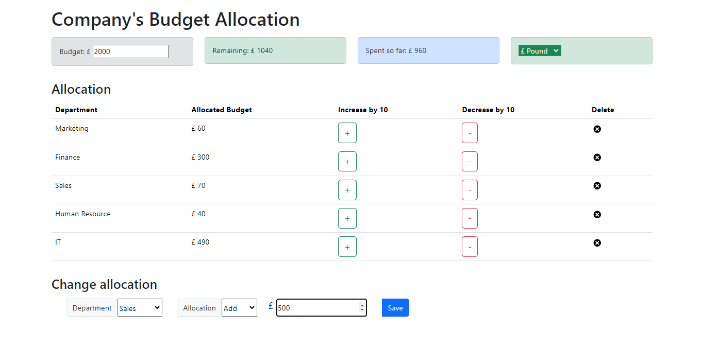

# React Budget Allocation App
A final project of "Developing Front End Apps with React" course by Coursera.

## Features
Features implemented in this project are:
- Add or reduce budget
- Add or reduce spending (directly or by 10)
- Budget limitation
- Currency change
- Delete all spending

Features are implemented using Components, React Hooks (useState), Redux (Store, Procedure and Action), JSX (building HTML page), and Bootstrap (styling)